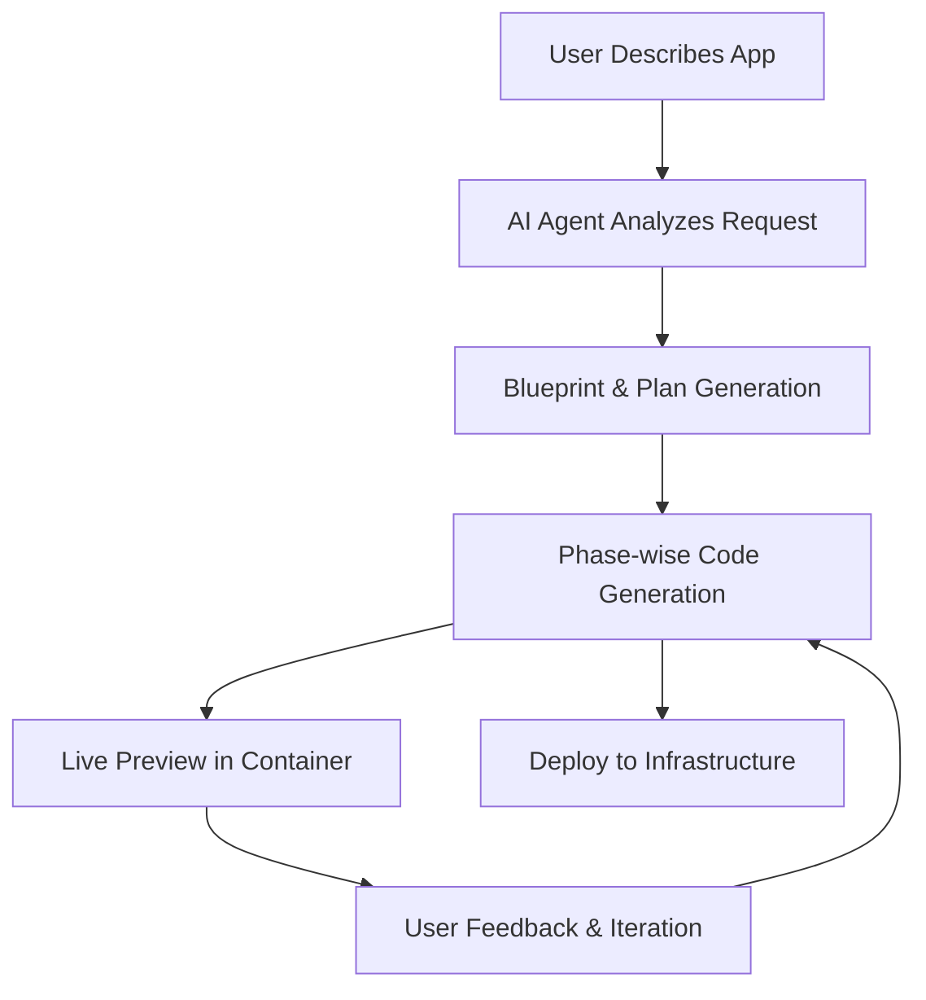

 Web4.sbs

> **A full-stack AI vibe coding platform by Kliq Technologies** – Build, deploy, and customize your own AI-powered app builder, running entirely on your infrastructure.

<div align="center">

 🚀 Live Demo

*Explore Web4.sbs Build before deploying your own stack.*

</div>

---

✨ What is Web4.sbs?

Web4.sbs is Kliq Technologies’ open-source AI coding platform that allows users to generate full-stack web applications from natural language descriptions. Once deployed, users can simply describe what they want, and the AI agent will build and deploy the application automatically, with live previews and incremental updates.

Whether you're a startup, SaaS platform, or internal team, Web4.sbs makes app creation effortless and scalable.

---

🎯 Perfect For

Startups & AI Platforms

* Build your own AI-powered app generation platform.
* Customize AI behavior and generated code patterns.
* Keep all customer data secure on your infrastructure.

Internal Teams

* Let non-technical staff create tools, dashboards, and workflows.
* Marketing, sales, and operations can launch apps without engineering bottlenecks.

SaaS Products

* Allow customers to extend your platform without coding.
* Build custom integrations, dashboards, and interfaces dynamically.

---

🎯 Key Features

🤖 **AI-Powered Code Generation** – Incremental, phase-wise development with error correction
⚡ **Live App Previews** – Run generated apps safely in isolated containers
💬 **Interactive Chat** – Refine applications through conversation
📱 **Modern Stack** – React + TypeScript + Tailwind by default
🚀 **One-Click Deployment** – Deploy apps instantly to your infrastructure
📦 **GitHub Integration** – Export projects directly to repositories

---

 🏗️ Platform Components

* **Frontend:** React + Vite + Tailwind
* **Backend:** Serverless runtime with stateful agents
* **Database:** SQLite / D1 with ORM
* **AI:** Multiple LLM integrations via gateway
* **Containers:** Sandboxed previews for safe app execution
* **Storage:** Object and key-value storage for sessions
* **Deployment:** Serverless hosting on Cloudflare / Web4 infrastructure

---

 📋 Deploy Checklist

 ✅ Prerequisites

* Cloudflare Workers Paid Plan (or alternative serverless runtime)
* API keys for AI providers (OpenAI, Google Gemini, etc.)

 🔑 Required Secrets

* `AI_API_KEY` – Your chosen AI provider
* `JWT_SECRET` – Session management
* `WEBHOOK_SECRET` – Webhook auth
* `SANDBOX_INSTANCE_TYPE` – Container performance tier
* `ALLOWED_EMAIL` – Access control for the app
* `CUSTOM_DOMAIN` – Custom domain configured in Cloudflare / DNS

🌐 DNS Setup for Custom Domains

* Add a wildcard CNAME pointing `*.yourdomain.com` → `yourdomain.com`
* Ensure proxying is enabled for secure previews

---

### 🏗️ Sandbox Instance Configuration

| Instance Type | Memory  | CPU       | Disk  | Use Case                  |
| ------------- | ------- | --------- | ----- | ------------------------- |
| `dev`         | 256 MiB | 1/16 vCPU | 2 GB  | Testing & development     |
| `standard-1`  | 4 GiB   | 1/2 vCPU  | 8 GB  | Light production apps     |
| `standard-2`  | 8 GiB   | 1 vCPU    | 12 GB | Medium workloads          |
| `standard-3`  | 12 GiB  | 2 vCPU    | 16 GB | Production apps (default) |
| `standard-4`  | 12 GiB  | 4 vCPU    | 20 GB | High-performance apps     |

> **Pro Tip:** Start with `standard-3` for most production apps; upgrade to `standard-4` if needed.

---

## 🎨 How It Works



Flow Summary:

1. User input → AI analyzes requirements
2. Blueprint & plan generated → code built in phases
3. Live preview → iterative refinement via chat
4. One-click deploy → fully functional web app

---

🔒 Security & Privacy

* Encrypted secrets stored safely
* Sandboxed execution prevents unsafe code from affecting other apps
* Input validation and AI content filtering
* Audit logs track all generation activity

---

🏠 Local Development

```bash
git clone https://github.com/KliqTechnologies/web4.sbs.git
cd web4.sbs
bun install  # or npm / yarn
bun run setup
bun run dev
```

Visit `http://localhost:5173` for local access. Production deploy via:

```bash
bun run deploy
```

---

## 🤝 Contributing

1. Fork the repo
2. Develop new features or improvements
3. Test thoroughly (`bun run test`)
4. Submit a Pull Request to the main repository

---

## 📄 License

MIT License – see [LICENSE](LICENSE) for details.
